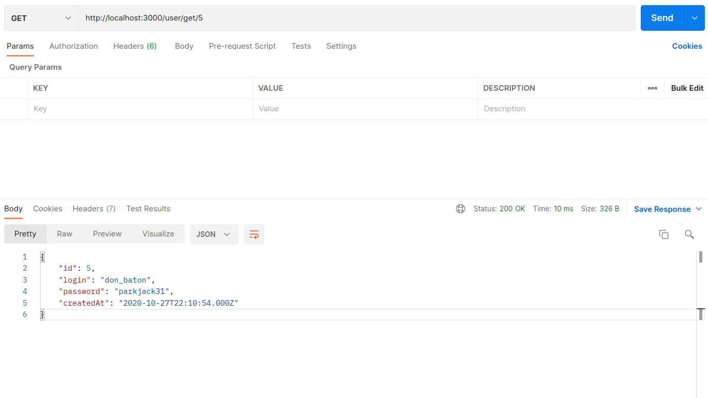
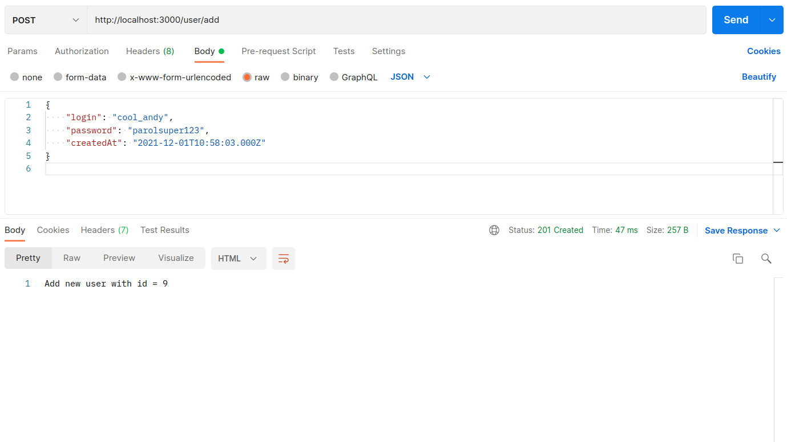
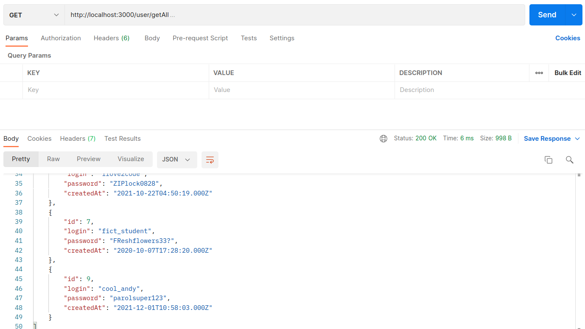
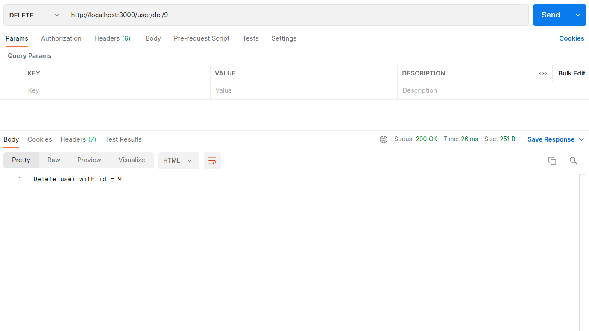

# Тестування працездатності системи

*В цьому розділі демонструється тестування розробленого програмного продукту за допомогою виконання HTTP запитів до веб-сервера.*

## Отримання сутності користувача (user)

## Додавання сутності користувача (user)

## Отримання всіх сутностей користувача (user)

## Оновлення сутності користувача (user)

## Видалення сутності користувача (user)

